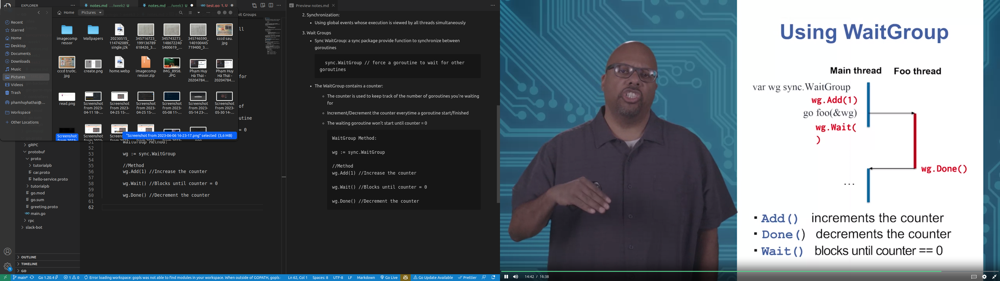
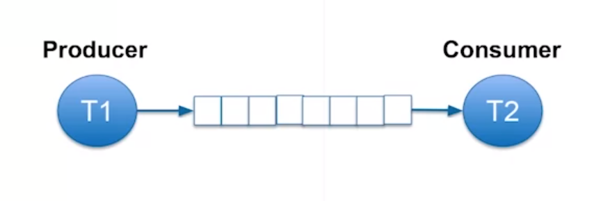

## Threads in Go

#### 1. Goroutines:
- One goroutine is automatically created to execute main()

- Other goroutines are created using ***go*** keyword

        a = 1;
        go foo();
        a = 2; 

- Goroutines exit when their codes are completed
- When main goroutine ends, other goroutines end (even if they haven't finished their jobs)

- Early exit: 
        
        func main() {
            go fmt.Printf("New routine");
            fmt.Printf("Main routine")
        }

- Only "Main routine" is printed? => the main routine finish before New routine start

- How to escape this?

        func main() {
            go fmt.Printf("New routine");
            time.Sleep(1*time.Second) //delay the main to delay
            fmt.Printf("Main routine")
        }

- Still everything is non-deterministic - you could never know whether the OS schedules or the go runtime scheduler schedule what task

--> Need formal synchronization constructs

#### 2. Synchronization:
- Using global events whose execution is viewed by all threads simultaneously

#### 3. Wait Groups

- Sync WaitGroup: a sync package provide function to synchronize between goroutines

        sync.WaitGroup // force a goroutine to wait for other goroutines

- The WaitGroup contains a counter:

  - The counter is used to keep track of the number of goroutines you're waiting for
  - Increment/Decrement the counter everytime a goroutine start/finished
  - The waiting goroutine won't start until counter = 0

        WaitGroup Method:
        
        wg := sync.WaitGroup

        //Method
        wg.Add(1) //Increase the counter

        wg.Wait() //Blocks until counter = 0

        wg.Done() //Decrement the counter
        

- Example:

        func foo(wg *sync.WaitGroup) {
                fmt.Print("New routine")
                wg.Done()
        }

        func main() {
                var wg sync.WaitGroup
                wg.Add(1)
                go foo(&wg)
                wg.Wait()
                fmt.Print("Main routine")
        }

#### 4. Communications:
- Goroutines usually work together to perform a bigger task
- Example: web server - many clients communicate with each other
- Often need to send data to collaborate between goroutines
- Example: multiply 4 integers by using 2 go routines, each multiply a pair, then main routine multiply 2 results
- Problem? - how to send the results to the main routine

- Problem solve: Using go channels
- Channels are typed

        c := make(chan int)

- Send and receive data using ***<-*** operator
  - Send: c <- 3 //send 3 to channel c
  - Receive data from a channel: x := <- c //x receive data from channel 3

#### 5. Blocking in Channels:
- Unbuffered channels can't hold data in transit
- Channel is unbuffered on default

#### 6. Buffered Channels:
- Channel Capacity: 0 on default (unbuffered)
- Capacity: the number of object it can hold in transit

        c := make(chan int, 3) //3 is the capacity

- Sending is block only when the buffer is full
- Which mean the above example can receive 3 data
- On the 4th data, the channel blocks
- The channel is
  - Send only: if buffer is full
  - Receive only: if buffer is empty

- Why using buffer? 

- Because the speed of producer & customer aren't exactly the same
- If the producer is too fast, there's still space in the buffer, or else the communication is blocked, vice versa
- It's still better if the speed match between them 