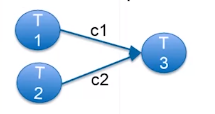

## Synchronized Communication

#### 1. Blocking on Channels:

- Common operation on channel: iterate through a channel

        for i:= range c {
            fmt.Println(i) //continues to read from channel c
        }

- One iteration each time a new value is received
- This loop could be infinite -> how to stop?
=> Close the channel

        close(c)

- Another operation: receive from multiple goroutines
    
  - Use case: data from both sources may be needed
  - Read sequentially
    
        a := <- c1
        b := <- c2
        fmt.Print(a*b)

  - Select statement: wait on the first data from a set of channels

        select {
            //case channels...
        }

#### 2. Select:

- Select: may either select send or receive operation

        select {
            case a = <-inchan
                fmt.Print("receive a")
            case outchan <- b
                fmt.Print("sent b")
        }

- Select with an abort channel: you may want to receive data until an abort signal is received

        for {
            select {
                case a <- c:
                    fmt.Print(a)
                case <-abort:
                    return //if something comes in abort channel, break the loop
            }
        }

- Default case: default operation to avoid blocking

        select {
            case a = <-c1:
                //do something
            case b = <- c2:
                //do something
            default:
                //if no case, do this
        }

#### 3. Mutual Exclusion

- Goroutine sharing variables: can cause problems
- Concurrency safe: function can be invoked concurrently without interfering othe goroutines

- Concurrency is at the machine code level

  - i = i + 1 might be three machine instructions: 
    - read i
    - increment
    - write i
    
    This might happen

#### 4. Sync.Mutex (mutual exclusion)

- Correct Sharing: just don't let 2 goroutines write to a shared variable at a time

- Restrict possible interleavings

- Mutual exclusion: code segments in different goroutines can't execute concurrently

- Writing to shared variables should be mutually exclusive

- Sync.Mutex: ensures mutual exclusion (prevent simultanious access to a shared resource)

    

#### 5. Mutex method

- Lock(): puts the flag up = shared var in use

- Unlock(): puts the flag down = shared var available

#### 6. Once Synchronization

- Sync initialization: must happen once before everything else

- Sync.Once
  - Has one method: once.Do(f)
  - f is executed only one time (even if it's called in multiple goroutines)
  - All calls to once.Do() block until the first returns
  - Ensure that initialization executes first

  - Example: 2 goroutines, initalization once

#### 7. Deadlock

- Synchronization Dependencies: syncs cause the execution of different goroutines to depend on each other

- Deadlock: circular dependencies: g1 waits for g2, g2 waits for g1

#### 8. Dining Philosophers:

- 5 philosophers sitting at a round table
- 1 chopstick is placed between each adjacent pair
- Only one philosopher can hold a chopstick at a time
- Not enough chopstick for everyone

- Each chopstick is a mutex
- Each philosopher is associated with a goroutine and 2 chopsticks

- Solution: each philo picks up the lowest numbered chopstick
- Philo 4 picks up chopstick 0 before chopstick 4
- No deadlock, but philo 4 may starve
- Starvation: not executed as much as others